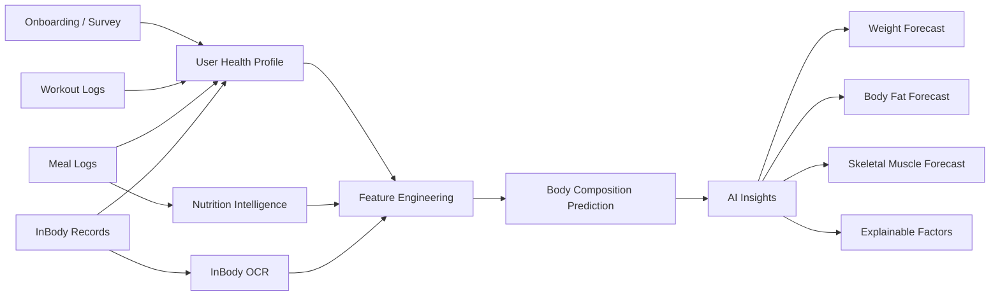
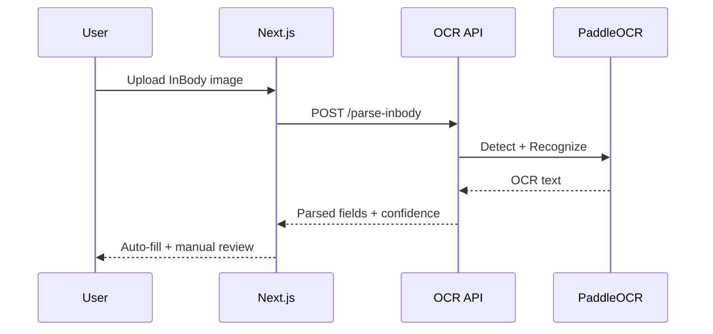
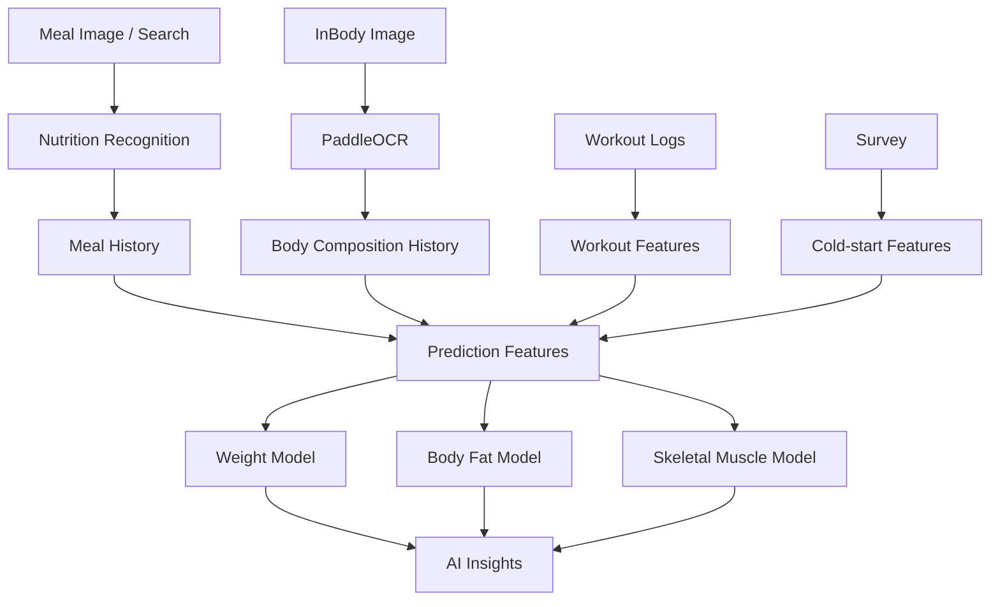
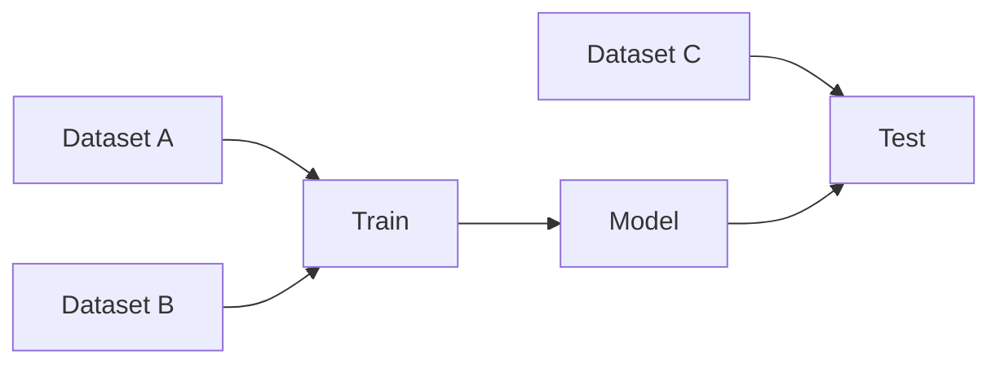
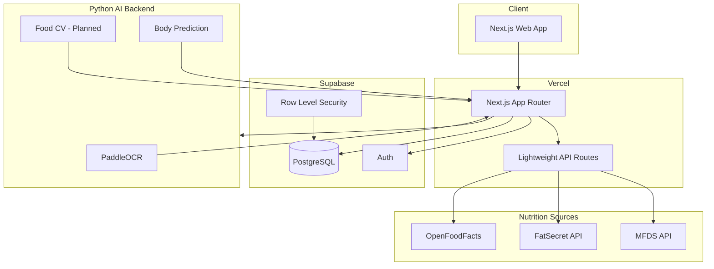

# FitTrack

> **운동·식단·체성분 기록을 넘어, 음식 사진 기반 영양 기록 자동화와 개인의 생활·운동·체성분 이력을 바탕으로 미래 체성분 변화를 예측하는 AI 피트니스 플랫폼**

[](https://nextjs.org/)
[](https://www.typescriptlang.org/)
[](https://supabase.com/)
[](https://vercel.com/)
[](https://www.python.org/)

<p align="center">
  <b>Wanted AI Championship 2026 출품 프로젝트</b><br/>
  기록 → 이해 → 예측으로 이어지는 개인화 피트니스 경험을 만듭니다.
</p>

---

## 🔗 Links

- **Live Demo**: [https://fitness-app-eta-henna.vercel.app/dashboard](https://fitness-kkt78uqoz-bbang-s-projects1.vercel.app/)
- **Repository**: https://github.com/Bbang03/fitness-app
- **Competition**: https://static.wanted.co.kr/ai-championship/2026/landing.html

> 현재 서비스는 해커톤 개발 단계입니다. 일부 AI 기능은 로컬 AI 서버 또는 실험 환경에서 동작하며, 프로덕션 배포 전 통합 작업이 진행 중입니다.

---

# 1. What is FitTrack?

FitTrack은 단순한 헬스 기록 앱이 아닙니다.

기존 피트니스 앱은 사용자가 운동, 식사, 체중을 각각 기록한 뒤 과거 데이터를 확인하는 데 초점이 맞춰져 있습니다.  
FitTrack은 여기서 한 단계 더 나아가 사용자가 남긴 기록을 **AI가 해석하고, 미래 변화까지 예측하는 것**을 목표로 합니다.

FitTrack이 집중하는 질문은 다음과 같습니다.

> **“지금처럼 먹고 운동한다면, 앞으로 내 몸은 어떻게 변할까?”**

이를 위해 다음 데이터를 하나의 개인 히스토리로 연결합니다.

- InBody / 체성분 데이터
- 온보딩 설문 데이터
- 식단 및 영양 기록
- 운동 세트 / 중량 / 반복 / 시간 기록
- 기록률과 최근 행동 패턴
- 과거 체성분 변화 이력

최종적으로는 이러한 정보를 기반으로 **향후 체중, 체지방, 골격근량 변화에 대한 개인화 예측과 설명**을 제공하는 것을 목표로 합니다.

---

# 2. Core Product Flow



서비스의 핵심은 **기록 데이터가 서로 독립적으로 존재하지 않고 하나의 예측 입력으로 연결되는 구조**입니다.

---

# 3. Main Features

## 🏠 Dashboard

사용자의 오늘 상태를 한 화면에서 확인합니다.

- 최근 운동 상태
- 최근 식단 기록
- 최근 InBody 측정
- 오늘의 기록 진행도
- 최근 영양 섭취 요약
- AI 체성분 예측 진입
- 주요 기능 Quick Action

Dashboard는 고정된 샘플 숫자가 아니라 Supabase의 실제 사용자 데이터를 기반으로 구성됩니다.

---

## 🏋️ Workout

루틴을 만들고 실제 운동을 기록할 수 있습니다.

### 지원 기능

- 운동 루틴 생성 / 수정 / 삭제
- 운동별 세트 관리
- 세트별 중량 및 반복 수 기록
- 시간 기반 운동 카운트다운
- 세트 추가 / 삭제
- 운동 완료 흐름
- 이전 동일 운동 기록 확인
- 최근 운동 히스토리
- Rest Timer
- Wake Lock
- 알림 / 완료음

운동 데이터는 향후 다음과 같은 AI feature로 변환될 예정입니다.

```text
weekly_workout_days
weekly_sets
weekly_reps
weekly_volume
workout_duration
training_frequency
recent_volume_change
```

---

## 🍽️ Meals & Nutrition

식단을 기록하고 영양 정보를 자동으로 탐색합니다.

### Nutrition Data Sources

- **식품의약품안전처(MFDS) 식품영양성분 DB**
- **FatSecret**
- **OpenFoodFacts**
- FitTrack `brand_foods` 캐시 / 보강 테이블

한국어 음식 검색은 MFDS 데이터를 우선 활용하고, 저장된 브랜드 음식 정보가 충분한 경우 캐시 데이터를 먼저 사용합니다.

### AI Macro Estimation

일부 외식 / 프랜차이즈 음식은 공식 영양 데이터에 탄수화물 또는 지방 값이 누락되어 있습니다.

FitTrack은 이러한 경우 MFDS 유사 음식 데이터를 이용한 **missing macro estimation**을 수행합니다.

현재 버전에서는 햄버거 계열 데이터에 대해 다음 정보를 활용합니다.

```text
kcal / 100g
protein / 100g
sugar / 100g
saturated fat / 100g
sodium / 100g
```

이후 유사 음식 기반 추정을 통해 누락된 탄수화물 / 지방을 보완합니다.

> 공식 값과 AI 추정값은 UI와 데이터 provenance에서 구분합니다.

---

## 📊 InBody

사용자의 체성분 변화를 기록하고 추적합니다.

### 주요 필드

- Weight
- Skeletal Muscle Mass
- Body Fat Mass
- Body Fat %
- Waist-Hip Ratio
- Visceral Fat Level
- Body Water
- BMR
- Protein
- Mineral

### InBody OCR

InBody 결과지를 촬영하거나 업로드하면 OCR을 통해 주요 수치를 추출합니다.

현재 OCR 파이프라인은 **PaddleOCR 기반 Python 서버**를 사용합니다.



OCR 결과는 confidence에 따라 자동 입력 여부를 다르게 처리합니다.

- 높은 confidence: 자동 입력
- 중간 confidence: 경고와 함께 입력
- 낮은 confidence: 후보만 제시하고 사용자 확인

원본 InBody 이미지는 현재 FitTrack 데이터베이스에 영구 저장하지 않습니다.

---

## 🤖 AI Insights

FitTrack AI의 최종 사용자 접점입니다.

현재 서비스에는 설명 가능한 `baseline-v1` 예측 로직이 연결되어 있으며, 별도로 실제 longitudinal 연구 데이터를 이용한 체성분 예측 모델을 실험하고 있습니다.

예측 화면은 다음 정보를 제공하는 것을 목표로 합니다.

- 30일 후 예상 체중 변화
- 예상 체지방 변화
- 예상 골격근량 변화
- 예측 confidence
- 예상 BMR / TDEE / energy balance
- 예측에 영향을 준 주요 요인
- 기록 completeness / readiness

---

# 4. AI Strategy

FitTrack은 하나의 거대한 AI 모델에 모든 기능을 맡기지 않습니다.

각 문제에 적합한 모델을 조합하는 구조를 사용합니다.



### Current AI Modules

| Module | Status | Description |
|---|---|---|
| Nutrition Search | ✅ Implemented | MFDS / FatSecret / OpenFoodFacts |
| Missing Macro Estimation | ✅ Implemented | 유사 영양 프로필 기반 탄수·지방 추정 |
| InBody OCR | ✅ Local v1 | PaddleOCR 기반 OCR assisted input |
| Body Prediction Baseline | ✅ Implemented | 설명 가능한 rule/physiology 기반 baseline |
| Longitudinal ML Research | 🚧 In progress | 실제 RCT 기반 cross-study benchmark |
| Food Image Recognition | 🗓️ Planned | 음식 이미지 → 음식 후보 → 영양 기록 |
| Production AI Server | 🗓️ Planned | OCR / CV / Prediction 통합 Python API |

---

# 5. Body Composition Prediction Research

FitTrack의 핵심 연구 질문은 다음과 같습니다.

> **“FitTrack이 실제로 수집할 수 있는 데이터만으로 미래 체성분 변화를 얼마나 정확하게 예측할 수 있는가?”**

서비스에서 실제 확보 가능한 정보는 네 가지입니다.

### 1. InBody

```text
weight
body_fat_pct
body_fat_mass
skeletal_muscle_mass
BMR
body_water
visceral_fat_level
...
```

### 2. Survey

```text
age
sex
height
activity level
goal
training experience
...
```

### 3. Meals

```text
average kcal
carbohydrate
protein
fat
protein / kg
meal coverage
recent intake trend
...
```

### 4. Workout

```text
frequency
sets
reps
training volume
duration
recent workload trend
...
```

---

## Research Validation

단순 random split은 같은 연구의 protocol을 모델이 외울 수 있기 때문에 FitTrack은 **Leave-One-Dataset-Out evaluation**을 중요하게 사용합니다.



현재 연구 파이프라인은 여러 실제 longitudinal RCT를 공통 transition schema로 정규화하여 사용합니다.

### Current Research Targets

```text
delta_weight
delta_body_fat_pct
delta_fat_mass
delta_lean_mass
```

> DXA 기반 lean mass는 InBody의 skeletal muscle mass와 같은 지표가 아닙니다.  
> 따라서 현재 공개 연구의 lean-mass 결과를 골격근량 예측 성능으로 직접 해석하지 않습니다.

### Model Candidates

- Ridge Regression
- Random Forest
- HistGradientBoosting
- CatBoost
- XGBoost
- Tabular foundation models
- Hall physiology baseline
- Physiology + ML residual hybrid

### Evaluation

- MAE
- RMSE
- Median Absolute Error
- R²
- Direction Accuracy
- User-group holdout
- Leave-One-Dataset-Out
- Bootstrap confidence interval
- Missing-data robustness

---

# 6. Prediction Philosophy

FitTrack은 단순히 높은 leaderboard score만을 목표로 하지 않습니다.

실제 서비스에서 사용할 수 없는 실험실 변수로 높은 성능을 만드는 것보다, **실제 앱에서 수집할 수 있는 데이터만으로 재현 가능한 모델을 만드는 것**을 우선합니다.

따라서 앞으로 모델 입력은 크게 다음 두 그룹으로 평가합니다.

### Research Upper Bound

연구 데이터셋에서 제공되는 모든 유용한 변수 사용.

### Production-Compatible

FitTrack에서 실제로 수집할 수 있는 변수만 사용.

```text
InBody
+ Survey
+ Meals
+ Workout
+ Recording Coverage
+ Recent Trends
```

최종 production 모델은 두 번째 기준을 만족해야 합니다.

---

# 7. System Architecture



### Deployment Direction

- **Vercel**
  - UI
  - Next.js API routes
  - authentication integration
  - lightweight nutrition search / estimation

- **Supabase**
  - PostgreSQL
  - Auth
  - Row Level Security
  - user-owned application data

- **Python AI Backend**
  - PaddleOCR
  - Food CV
  - final body composition prediction model

현재 OCR 서버는 로컬에서 동작합니다.

```text
INBODY_OCR_URL=http://127.0.0.1:8001
```

따라서 Vercel 프로덕션 환경에서는 localhost OCR 서버를 호출할 수 없으며, 제출 전 Python AI backend 배포가 필요합니다.

---

# 8. Supabase Data Model

주요 테이블은 다음과 같습니다.

```text
profiles
prediction_profiles

routines
routine_items

workout_logs
set_logs

meal_logs
meal_items
brand_foods

inbody_records
```

### Security

사용자 데이터 테이블은 Supabase RLS를 통해 자신의 데이터만 접근할 수 있도록 구성합니다.

```text
auth.uid() = user_id
```

Guest 사용자는 로컬 상태를 사용할 수 있으며, 로그인 사용자는 Supabase 데이터를 사용합니다.

---

# 9. App Information Architecture

```text
Home        /dashboard
Workout     /routines
Meals       /meals
InBody      /inbody
AI          /insights
```

Workout history:

```text
/history
```

Bottom Navigation:

```text
홈 / 운동 / 식단 / 체성분 / AI
```

---

# 10. Tech Stack

## Frontend / Web

- Next.js 15
- React
- TypeScript
- App Router
- Vercel

## Backend / Database

- Supabase
- PostgreSQL
- Supabase Auth
- Row Level Security

## AI / ML

- Python
- PaddleOCR
- scikit-learn
- CatBoost
- XGBoost
- physiology-based modeling
- tabular foundation model research

## External Data

- MFDS Food Nutrition API
- FatSecret Platform API
- OpenFoodFacts

---

# 11. Getting Started

## 11.1 Clone

```bash
git clone https://github.com/Bbang03/fitness-app.git
cd fitness-app
```

현재 개발 브랜치를 사용하는 경우:

```bash
git checkout feat/supabase-integration
```

## 11.2 Install

```bash
npm install
```

## 11.3 Environment Variables

프로젝트 루트에 `.env.local`을 생성합니다.

> `.env.local`은 Git에 커밋하지 않습니다.  
> 실제 key / secret은 팀 내부 안전한 채널로 공유합니다.

예시:

```env
# Supabase
NEXT_PUBLIC_SUPABASE_URL=YOUR_SUPABASE_URL
NEXT_PUBLIC_SUPABASE_PUBLISHABLE_KEY=YOUR_SUPABASE_PUBLISHABLE_KEY

# MFDS
MFDS_SERVICE_KEY=YOUR_MFDS_SERVICE_KEY

# FatSecret
# 실제 코드에서 사용하는 환경 변수명에 맞춰 팀 credential을 설정하세요.
# Client secret은 절대 NEXT_PUBLIC_* 변수로 노출하지 않습니다.

# InBody OCR
INBODY_OCR_URL=http://127.0.0.1:8001
```

### Secret Rule

다음 값은 브라우저 코드 또는 GitHub에 노출하면 안 됩니다.

```text
Supabase service_role / secret key
FatSecret client secret
MFDS private service credentials
기타 server-side secret
```

---

# 12. Run Web App

```bash
npm run dev
```

브라우저:

```text
http://localhost:3000
```

Production build check:

```bash
npm run build
```

---

# 13. Run InBody OCR Server

OCR 기능을 로컬에서 사용하려면 Python 환경이 필요합니다.

현재 개발 환경 예시:

```bash
python -m uvicorn app:app --app-dir ocr-server --host 127.0.0.1 --port 8001
```

그리고 `.env.local`:

```env
INBODY_OCR_URL=http://127.0.0.1:8001
```

Web App과 OCR server를 각각 실행합니다.

```text
Terminal A
→ npm run dev

Terminal B
→ python -m uvicorn app:app --app-dir ocr-server --host 127.0.0.1 --port 8001
```

---

# 14. Repository Guide

프로젝트의 주요 책임 영역은 다음과 같이 나뉩니다.

```text
fitness-app/
│
├─ app/
│  ├─ api/
│  │  ├─ inbody/
│  │  ├─ macro-estimate/
│  │  ├─ mfds/
│  │  └─ ...
│  │
│  ├─ dashboard/
│  ├─ routines/
│  ├─ history/
│  ├─ meals/
│  ├─ inbody/
│  └─ insights/
│
├─ components/
│  ├─ AppShell
│  ├─ BottomNav
│  └─ ...
│
├─ lib/
│  ├─ prediction
│  ├─ Supabase-related modules
│  └─ ...
│
├─ ocr-server/
│  └─ PaddleOCR FastAPI server
│
└─ README.md
```

> 실제 디렉터리는 개발 과정에서 변경될 수 있습니다. 새로운 기능을 추가하기 전에 기존 책임 영역을 먼저 확인해 주세요.

---

# 15. Development Workflow

팀 작업 시 가능한 한 기능 단위 브랜치를 사용합니다.

예:

```text
feat/workout-ui
feat/meals-search
feat/inbody-ocr
feat/body-prediction
fix/auth-session
chore/readme
```

권장 흐름:

```bash
git checkout -b feat/your-feature
git add .
git commit -m "feat: describe your change"
git push -u origin feat/your-feature
```

작은 수정이라도 다음을 확인한 뒤 push 해주세요.

```bash
npm run build
```

---

# 16. Commit Convention

권장 prefix:

| Prefix | Use |
|---|---|
| `feat:` | 새로운 기능 |
| `fix:` | 버그 수정 |
| `refactor:` | 기능 변화 없는 구조 개선 |
| `chore:` | 설정 / 문서 / 유지보수 |
| `docs:` | 문서 |
| `test:` | 테스트 |
| `style:` | UI / formatting |

예시:

```text
feat: add nutrition search and AI macro estimation
feat: add InBody OCR assisted input
fix: normalize meal nutrition provenance
docs: add project architecture and setup guide
```

---

# 17. Current Development Status

## Completed

- [x] Supabase Auth / Login / Signup
- [x] Onboarding / prediction profile
- [x] Supabase RLS
- [x] Routine CRUD
- [x] Workout logging / history
- [x] Meal CRUD
- [x] MFDS nutrition search
- [x] FatSecret / OpenFoodFacts nutrition integration
- [x] Brand food cache
- [x] Missing macro estimation
- [x] InBody CRUD
- [x] InBody OCR assisted input
- [x] Dashboard real-data hydration
- [x] AI Insights baseline
- [x] Longitudinal body prediction research pipeline

## In Progress

- [ ] Production-compatible body composition prediction benchmark
- [ ] Weight / body-fat / skeletal-muscle model separation
- [ ] Relative physiology feature engineering
- [ ] Prediction confidence / coverage modeling
- [ ] AI backend production deployment
- [ ] Mobile UX QA
- [ ] UI humanization / design polish

## Planned

- [ ] Food image recognition
- [ ] Unified Python AI backend
- [ ] Production InBody OCR
- [ ] Final prediction model integration
- [ ] Production E2E
- [ ] Demo account / demo data
- [ ] Submission video / architecture materials

---

# 18. Privacy & Health Data

FitTrack은 체중, 체지방, 골격근량 등 개인의 민감할 수 있는 건강 관련 정보를 처리합니다.

개발 시 다음 원칙을 우선합니다.

- 최소한의 데이터만 수집
- 사용자별 DB 접근 제어
- RLS 적용
- secret의 client exposure 금지
- 원본 InBody 이미지 불필요한 영구 저장 금지
- AI prediction을 의학적 진단처럼 표현하지 않기
- 예측값과 실제 측정값 명확히 구분
- AI 추정 영양값과 공식 영양값 구분
- confidence / provenance 유지

FitTrack의 예측 결과는 건강 상태를 진단하거나 의료 전문가의 판단을 대체하기 위한 것이 아닙니다.

---

# 19. Why This Project Matters

피트니스 데이터는 이미 많이 수집되고 있습니다.

문제는 대부분의 서비스가 데이터를 다음 수준에서 멈춘다는 것입니다.

```text
기록
↓
차트
↓
과거 확인
```

FitTrack은 다음 단계로 이동하려고 합니다.

```text
기록
↓
통합
↓
AI 해석
↓
미래 예측
↓
행동 의사결정
```

즉 사용자가 기록을 남기는 이유를 단순한 아카이빙이 아니라 **미래의 몸 변화를 이해하기 위한 데이터 축적**으로 바꾸는 것이 목표입니다.

---

# 20. Hackathon

FitTrack은 **Wanted AI Championship 2026** 참가 프로젝트입니다.

대회의 핵심 요구사항인 **AI를 활용해 실제 문제를 해결하고, 실제 동작하는 서비스로 구현·배포하는 것**을 목표로 개발 중입니다.

주요 일정:

```text
09.18  참가 접수 마감
09.20  과제 제출 마감
09.21 ~ 10.05  예선 심사 및 투표
10.07  TOP20 발표
10.17  Demo Day
```

---

# 21. Team Note

처음 프로젝트에 합류했다면 다음 순서로 확인하는 것을 권장합니다.

1. README 전체 흐름 확인
2. Vercel Demo 확인
3. `.env.local` 설정
4. `npm install`
5. `npm run dev`
6. 로그인 / onboarding 확인
7. Workout → Meals → InBody → Insights 순서로 기능 확인
8. 담당 기능 브랜치 생성
9. 개발 후 `npm run build`
10. commit / push

---

# 22. Product Vision

FitTrack이 궁극적으로 만들고 싶은 경험은 간단합니다.

> **“기록을 열심히 하면 차트가 늘어나는 앱”이 아니라  
> “기록이 쌓일수록 나를 더 잘 이해하고 미래를 더 잘 예측하는 앱.”**

사용자가 남기는 매일의 식사, 운동 한 세트, 그리고 한 번의 InBody 측정이  
시간이 지날수록 더 정확한 개인 모델을 만드는 데이터가 되는 것이 FitTrack의 방향입니다.

---

## Built for Wanted AI Championship 2026

**FitTrack — Record today. Understand tomorrow.**
