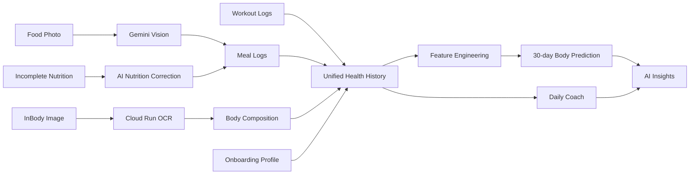
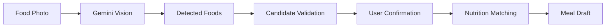
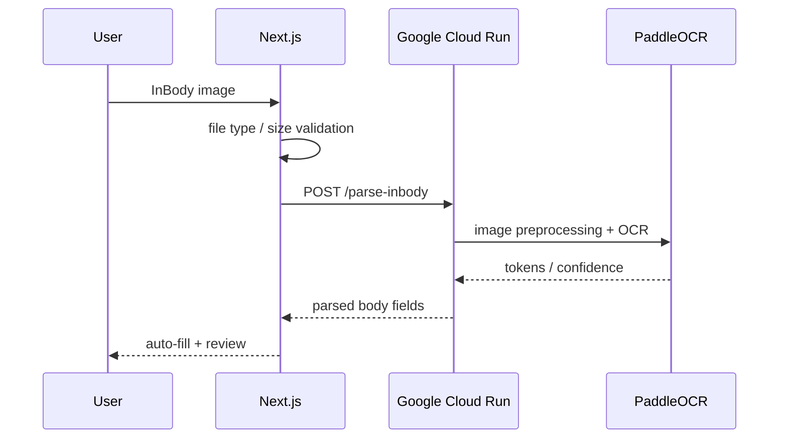

# ChaGOK (차곡)

> **운동·식단·체성분 기록을 하나로 연결하고, AI를 통해 기록 부담을 줄이며 미래의 몸 변화를 이해하도록 돕는 모바일 중심 건강관리 서비스**

[](https://nextjs.org/)
[](https://react.dev/)
[](https://www.typescriptlang.org/)
[](https://supabase.com/)
[](https://ai.google.dev/)
[](https://playwright.dev/)
[](https://vercel.com/)

<p align="center">
  <b>Wanted AI Championship 2026 출품 프로젝트</b><br/>
  기록 → 통합 → AI 해석 → 미래 예측
</p>

---

## Links

- **Live Demo**: https://fitness-app-eta-henna.vercel.app
- **Repository**: https://github.com/Bbang03/fitness-app
- **Wanted AI Championship 2026**: https://static.wanted.co.kr/ai-championship/2026/landing.html

---

# 0. Project Handoff / 현재 상태 복구용 안내

이 README는 단순 서비스 소개가 아니라 **프로젝트 인수인계 문서** 역할도 한다.

새로운 개발자 또는 새로운 AI 세션이 프로젝트를 이어받는 경우 이 README를 먼저 읽고, 이후 저장소의 실제 코드를 source of truth로 사용한다.

### 기능 기준 snapshot

README 최신화 직전 기능 코드 기준:

```text
branch : master
commit : cd45598e619ad64fb68dea31bb44f88622630cd2
message: fix: harden workout tracking and protected APIs
```

README 수정 이후에는 문서 commit이 추가될 수 있으므로 위 SHA는 **현재 완성 기능의 기준점**으로 이해하면 된다.

### 중요한 문서 우선순위

```text
README.md
    ↓
현재 실제 코드
    ↓
models/*.json
    ↓
tests/e2e/*
    ↓
CLAUDE.md / GUARDIAN_SPEC.md
```

`CLAUDE.md`에는 초기 설계 시점의 내용이 남아 있어 현재 구현과 다른 부분이 있다.

예를 들어 다음과 같은 내용은 현재 상태보다 오래되었다.

- FitTrack이라는 과거 이름
- AI 체성분 모델을 추후 구현한다는 설명
- Food Image Recognition을 planned라고 표현한 내용
- OCR을 local-only라고 표현한 내용

따라서 **현재 프로젝트 상태를 판단할 때 README와 실제 코드를 우선한다.**

---

# 1. What is ChaGOK?

운동, 식단, 체성분은 서로 밀접하게 연결되어 있지만 대부분의 서비스에서는 각각 따로 기록된다.

사용자는 데이터를 열심히 기록해도 결국 다음과 같은 질문에 답하기 어렵다.

> **“그래서 지금처럼 먹고 운동하면 내 몸은 앞으로 어떻게 변할까?”**

ChaGOK은 운동·식단·체성분 데이터를 하나의 개인 히스토리로 연결하고,

```text
기록
↓
통합
↓
AI 해석
↓
미래 체성분 예측
↓
다음 행동
```

으로 이어지는 경험을 만드는 것을 목표로 한다.

---

# 2. Product Philosophy

기존 기록 앱:

```text
기록
↓
차트
↓
과거 확인
```

ChaGOK:

```text
운동 ─┐
식단 ─┼→ 통합 건강 기록 → AI 해석 → 미래 예측
체성분 ┘                     ↓
                           다음 행동
```

핵심 메시지:

> **“기록을 열심히 하면 차트가 늘어나는 앱”이 아니라  
> “기록이 쌓일수록 나를 더 잘 이해하고 미래를 더 잘 예측하는 앱.”**

---

# 3. Information Architecture

현재 주요 화면은 다음과 같다.

```text
/                 → entry
/dashboard        → 홈
/routines         → 운동
/history          → 운동 기록
/meals            → 식단
/meals/add        → 음식 추가 / 사진 인식
/inbody           → 체성분
/inbody/new       → 체성분 입력 / OCR
/insights         → AI 인사이트
/onboarding       → 사용자 프로필 / 예측용 초기 정보
```

하단 Navigation:

```text
홈 / 운동 / 식단 / 체성분 / AI
```

---

# 4. Core Product Flow


```mermaid
flowchart LR
    W[Workout Logs] --> H[Unified Health History]
    M[Meal Logs] --> H
    B[Body Composition] --> H
    S[Onboarding Profile] --> H

    P[Food Photo] --> V[Gemini Vision]
    V --> M

    N[Incomplete Nutrition] --> NC[AI Nutrition Correction]
    NC --> M

    I[InBody Image] --> O[Cloud Run OCR]
    O --> B

    H --> F[Feature Engineering]
    F --> BP[30-day Body Prediction]

    H --> DC[Daily Coach]

    BP --> AI[AI Insights]
    DC --> AI
```

---

# 5. Home / Dashboard

홈 화면은 사용자의 최근 건강 기록을 한 번에 보여주는 허브다.

현재 포함되는 주요 요소:

- 운동 누적 성장 상태
- 돌 골렘 / Guardian 성장
- 상체·하체·코어 운동 진행
- 식단 연속 기록 streak
- 오늘 섭취 칼로리
- 탄수화물 / 단백질 / 지방
- Daily Coach
- 사진 기반 식단 기록 진입
- 월간 활동 캘린더
- 날짜별 운동·식단 기록 조회
- AI 인사이트 진입

관련 주요 코드:

```text
app/dashboard/page.tsx

components/dashboard/
├─ ActivityCalendar.tsx
├─ DailyCoachCard.tsx
└─ SelectedDayDetail.tsx

components/golem/GolemAvatar.tsx

lib/
├─ guardianProgress.ts
├─ nutritionStreak.ts
├─ calendarSummary.ts
└─ golem/
```

---

# 6. Guardian / Golem Growth

운동 기록을 gamification 요소와 연결한다.

별도의 캐릭터 상태를 직접 저장하는 방식보다 **완료된 Workout Log를 기반으로 성장 상태를 계산하는 방식**을 사용한다.

운동 기록은 크게 다음 부위에 연결된다.

```text
상체
하체
코어
유산소 / 전체 활동
```

관련 파일:

```text
GUARDIAN_SPEC.md

components/
├─ GuardianProgressCard.tsx
├─ StoneGuardian.tsx
└─ golem/GolemAvatar.tsx

lib/
├─ guardianProgress.ts
└─ golem/

public/
├─ golem/
└─ guardian/stages/
```

`GUARDIAN_SPEC.md`는 설계 의도를 이해하기 위한 문서이며, 실제 UI 구현 여부는 현재 component와 public asset을 확인한다.

---

# 7. Workout

## Routine

사용자가 직접 운동 루틴을 만들고 수정할 수 있다.

지원 구조:

- 루틴 생성 / 수정 / 삭제
- 운동 라이브러리
- 즐겨찾기
- 운동 순서
- 목표 세트
- 세트별 목표
- 중량
- 반복 횟수
- 시간 기반 운동
- 휴식 시간
- superset group 구조

운동 record type:

```text
weight_reps
reps_only
time
```

주요 코드:

```text
app/routines/page.tsx
app/routines/new/page.tsx
app/routines/[id]/page.tsx
app/exercises/select/page.tsx
lib/exerciseData.ts
lib/routineValidation.ts
lib/store.ts
```

---

# 8. Workout Execution UX

운동 수행 화면은 실제 모바일 운동 환경에서 빠르게 조작할 수 있도록 개선했다.

주요 기능:

- 루틴 시작 확인 popup
- 첫 운동으로 빠르게 진입
- 세트별 중량 / 반복 수 변경
- 빠른 `+ / -` 입력
- 실제 수행 반복 횟수 `0회` 기록 가능
- 음수 반복 방지
- decimal weight
- 시간 기반 운동
- 세트 완료
- 운동 전환
- 운동 완료
- Workout History
- Wake Lock

주요 코드:

```text
app/routines/[id]/workout/page.tsx
hooks/useWakeLock.ts
lib/store.ts
```

---

# 9. Rest Timer Design

초기 구현에서는:

```text
세트 완료
↓
REST phase
↓
타이머 종료
↓
다음 세트
```

형태로 휴식 시간이 workout progression을 막았다.

현재 설계는 다음과 같다.

```text
세트 완료
↓
휴식 타이머 시작
↓
타이머가 표시되는 동안
다음 세트 수정 / 수행 가능
```

즉 휴식 타이머는 **blocking state가 아니라 informational state**다.

지원 기능:

- 현재 남은 휴식 시간
- 휴식 시간 증가 / 감소
- skip
- 휴식 중 다음 세트 수행
- 운동 흐름과 timer 분리

---

# 10. Workout Persistence

Zustand Persist를 사용하여 운동 중 상태를 유지한다.

사용자가:

```text
운동 시작
→ 세트 값 수정
→ 페이지 reload
```

를 수행해도 현재 운동 상태를 복구할 수 있다.

특히 QA 과정에서 발견된:

> **완료하지 않은 현재 세트의 draft weight / reps가 reload 후 유실되는 문제**

를 수정하여 draft도 persistence 대상에 포함시켰다.

관련 핵심 파일:

```text
lib/store.ts
```

---

# 11. Workout Race Condition Fix

자동 stress test 과정에서 다음 문제를 발견했다.

```text
1세트 완료 버튼을 매우 빠르게 여러 번 클릭
↓
2세트, 3세트까지 동시에 완료
```

마지막 운동에서는 잔여 click이 완료 화면의 다음 action으로 전달될 가능성도 있었다.

해결:

- completion input lock
- 중복 완료 방지
- click-through 방지
- regression E2E test 추가

이 사례는 ChaGOK에서 AI-assisted QA가 실제 제품 bug를 발견한 대표 사례다.

---

# 12. Meals & Nutrition

식단 탭은 다음 방식을 함께 제공한다.

- 내부 음식 DB
- 외부 음식 검색
- 직접 음식 추가
- 음식 사진 AI 인식
- 섭취량 조절
- 영양정보 자동 계산
- 식단 수정 / 삭제
- 일일 영양 집계

주요 코드:

```text
app/meals/page.tsx
app/meals/add/page.tsx

components/PhotoMealScanner.tsx

lib/
├─ foodData.ts
├─ mealSave.ts
├─ portion.ts
├─ fatsecret.ts
├─ webNutrition.ts
└─ visionCandidateValidation.ts
```

---

# 13. Nutrition Data Sources

현재 코드에는 여러 영양 데이터 소스가 연결되어 있다.

```text
MFDS
FatSecret
OpenFoodFacts
USDA
ChaGOK internal food DB
Supabase brand_foods cache
```

API routes:

```text
app/api/mfds/search/route.ts

app/api/fatsecret/
├─ search/route.ts
└─ food/route.ts

app/api/openfoodfacts/search/route.ts
app/api/usda/search/route.ts

app/api/nutrition/web-estimate/route.ts
```

음식 데이터는 출처에 따라 영양정보 completeness가 다르므로 저장 전에 normalize / validation 과정을 거친다.

---

# 14. g / mL Serving

고형 음식과 음료의 단위를 구분한다.

예:

```text
고구마 → g
Sprite → mL
```

MFDS 등의 원본 데이터에서 serving unit을 확인하여 volume 기반 음식은 `mL`, 일반 고형 음식은 `g`로 UI에 표시한다.

---

# 15. AI Food Image Recognition

Gemini Vision을 이용해 식사 사진을 분석한다.

API:

```text
POST /api/vision/recognize
```

구현 파일:

```text
app/api/vision/recognize/route.ts
components/PhotoMealScanner.tsx
lib/visionCandidateValidation.ts
```

흐름:


```mermaid
flowchart LR
    A[Food Photo] --> B[Gemini Vision]
    B --> C[Detected Foods]
    C --> D[Candidate Validation]
    D --> E[User Confirmation]
    E --> F[Nutrition Matching]
    F --> G[Meal Draft]
```

Gemini가 반환하는 정보:

- 음식 여부
- 음식별 이름
- raw detected name
- 예상 중량
- portion
- confidence
- bounding box
- visual candidates
- 후보별 confidence
- 후보 판단 근거
- DB 실패 시 참고용 estimated nutrition

### 중요한 설계 원칙

사진만으로 확정하기 어려운 음식을 억지로 하나로 단정하지 않는다.

예:

```text
돈까스 vs 새우튀김
소고기 버거 vs 치킨버거 vs 새우버거
```

시각적 근거가 부족하면 여러 후보를 제시하고 사용자 확인을 받는다.

Gemini 결과를 그대로 저장하는 것이 아니라:

```text
Gemini
↓
candidate validation
↓
internal / external nutrition search
↓
user confirmation
↓
meal record
```

과정을 거친다.

---

# 16. AI Nutrition Correction

공식 영양정보가 불완전한 음식의 누락 macro를 보완하는 기능이다.

구현:

```text
app/api/macro-estimate/route.ts
```

핵심 원칙:

> **공식 영양값이 존재하면 AI가 그 값을 덮어쓰지 않는다.**

## Case A — Carb 존재 / Fat 누락

Gemini 호출 없음.

공식:

```text
kcal
protein
carbohydrate
```

을 이용해 energy equation으로 지방을 계산한다.

개념식:

```text
remaining kcal
= kcal - protein * 4

fat
= (remaining kcal - carbohydrate * 4) / 9
```

---

## Case B — Fat 존재 / Carb 누락

Gemini 호출 없음.

```text
carbohydrate
= (remaining kcal - fat * 9) / 4
```

---

## Case C — Carb / Fat 모두 누락

이 경우 Gemini를 사용한다.

단 Gemini에게:

```text
carbs = ? g
fat   = ? g
```

를 직접 생성시키지 않는다.

Gemini는:

```text
carb_energy_share
confidence
reasoning
```

만 반환한다.

그 후 최종 g 값은 서버에서 공식 kcal / protein을 기준으로 계산한다.

따라서 구조는:

```text
Official Nutrition
↓
Known kcal + protein
↓
Gemini estimates only energy split
↓
Server calculates carb / fat
↓
Validation
```

---

# 17. Nutrition Constraints

AI 또는 계산 결과는 추가 검증을 거친다.

주요 constraint:

- kcal는 공식값 유지
- protein은 공식값 유지
- carbohydrate ≥ sugar
- fat ≥ saturated fat
- finite number
- 음수 방지
- 비현실적으로 큰 값 방지
- energy consistency 검증

자동 QA 과정에서 AI가 다음과 같은 비정상 값을 반환할 경우를 테스트했다.

```text
NaN
Infinity
1e300
string
negative values
malformed JSON
HTTP 500
timeout
```

비정상 결과는 화면에 그대로 표시하지 않고 fallback 또는 사용자 직접 입력으로 전환한다.

---

# 18. Nutrition Provenance & Cache

AI 보정 결과는 Supabase `brand_foods`에 캐시할 수 있다.

관련 metadata:

```text
macro_status
macro_confidence
macro_provenance
source_name
external_id
```

AI 결과 예:

```text
macro_status = ai_estimated
source_name  = CHAGOK AI + MFDS
```

동일 음식이 다시 요청되면 저장된 데이터가 현재 MFDS 정보와 충분히 일치하는지 확인한 후 cache를 재사용한다.

목적:

```text
AI 비용 절감
+
응답 속도 개선
+
결과 일관성
+
provenance 유지
```

---

# 19. Body Composition

체성분 탭에서 다음과 같은 정보를 기록한다.

- 체중
- 골격근량
- 체지방량
- 체지방률
- 체수분
- 기초대사량
- 단백질
- 무기질
- 복부지방률
- 내장지방

기능:

- 새로운 측정값 저장
- 최근 기록
- 이전 기록 비교
- 증감 표시
- metric별 추세 그래프
- 과거 측정 기록

주요 코드:

```text
app/inbody/page.tsx
app/inbody/new/page.tsx
lib/store.ts
```

---

# 20. InBody OCR

InBody 결과지를 이미지로 업로드하여 주요 체성분 수치의 입력을 보조한다.

프론트 API:

```text
POST /api/inbody/parse
```

구현:

```text
app/api/inbody/parse/route.ts
ocr-server/
```

Production flow:


```mermaid
sequenceDiagram
    participant User
    participant Next as Next.js
    participant Cloud as Google Cloud Run
    participant OCR as PaddleOCR

    User->>Next: InBody image
    Next->>Next: file type / size validation
    Next->>Cloud: POST /parse-inbody
    Cloud->>OCR: image preprocessing + OCR
    OCR-->>Cloud: tokens / confidence
    Cloud-->>Next: parsed body fields
    Next-->>User: auto-fill + review
```

현재 Next.js route에는 Cloud Run OCR endpoint를 사용할 수 있는 구조가 구현되어 있으며 `INBODY_OCR_API_URL`로 override할 수 있다.

OCR API는 별도 API key로 보호한다.

### OCR stack

```text
PaddleOCR 3.7
PaddlePaddle 3.2
FastAPI
Uvicorn
NumPy
Pillow
python-multipart
```

`ocr-server/requirements.txt` 참고.

OCR은 단순 전체 텍스트 인식뿐 아니라 ROI, 여러 image preprocessing variant, confidence와 숫자 범위 등을 이용해 잘못된 숫자의 자동 입력 가능성을 줄이도록 구성되어 있다.

---

# 21. AI Body Composition Prediction

ChaGOK의 핵심 차별화 기능이다.

사용자에게 약 30일 후 체성분 변화를 예측한다.

현재 예측 대상:

```text
weight_kg
fat_mass_kg
skeletal_muscle_kg
body_fat_pct
```

UI:

```text
app/insights/page.tsx
```

Python runtime:

```text
api/
├─ index.py
├─ model_runtime.py
├─ behavior_runtime.py
├─ behavior_correction_runtime.py
└─ prediction_interval_runtime.py
```

Model artifacts:

```text
models/
├─ weight_model.cbm
├─ fat_mass_model.cbm
├─ smm_model.cbm
├─ manifest.json
├─ feature_contract.json
├─ prediction_interval_v1.json
└─ behavior_correction_v1/
```

---

# 22. Base Prediction Model

Production base model:

```text
Estimator : CatBoostRegressor
Version   : 1.0.0
Window    : 28–35 days
Rows      : 975
Participants: 128
```

training parameters:

```text
iterations    = 500
depth         = 5
learning_rate = 0.035
loss          = MAE
```

현재 모델은 future absolute value를 바로 예측하는 것이 아니라 변화량 기반 예측을 current value에 결합한다.

개념:

```text
future = current + alpha × predicted_delta
```

대상별 alpha:

```text
Weight       0.75
Fat Mass     0.75
SMM          0.50
```

체지방률은 예측된 체중과 fat mass를 기반으로 계산한다.

```text
BF% = 100 × predicted fat mass / predicted weight
```

---

# 23. Body Prediction Features

feature contract:

```text
models/feature_contract.json
```

core current-body features:

```text
weight0_kg
fat0_kg
smm0_kg
bf0_pct
```

history features:

```text
has_prev
days_since_prev

slope30_from_prev_weight
slope30_from_prev_fat
slope30_from_prev_smm
slope30_from_prev_bf

has_prev2
days_between_prev1_prev2

history_n_prior
history_count_30d
history_count_90d
history_count_180d

slope30_prevtrend_*

ols30_90d_*
ols30_180d_*
```

중요 leakage rule:

```text
measurement_time < current measurement time
```

즉 현재 시점 이후의 측정값은 feature 구성에 절대 사용하지 않는다.

같은 timestamp의 중복 측정은 median collapse한다.

---

# 24. Prediction Model Internal Validation

`models/manifest.json`에 보존된 내부 participant-safe nested OOF validation 결과:

| Target | Participant Macro MAE |
| --- | ---: |
| Weight | 약 **1.10 kg** |
| Fat Mass | 약 **0.95 kg** |
| Skeletal Muscle Mass | 약 **0.56 kg** |
| Body Fat % | 약 **1.04 %p** |

중요:

> 이 숫자는 independent external validation이나 실제 production deployment accuracy가 아니다.

manifest에도 다음과 같이 명시되어 있다.

```text
internal participant-safe validation
not independent external validation
```

따라서 이 수치를 사용자에게 “실제 오차” 또는 “보장 정확도”처럼 표현하면 안 된다.

---

# 25. Behavior Correction

Base body prediction 이후 최근 식단 행동을 이용한 correction layer가 있다.

관련 파일:

```text
api/behavior_runtime.py
api/behavior_correction_runtime.py

models/
├─ behavior_feature_contract.json
├─ behavior_correction_contract.json
├─ behavior_correction_dataset_manifest.json
└─ behavior_correction_v1/
```

개념:

```text
Frozen Base Prediction
+
Recent Behavior
↓
Behavior Correction
↓
Final Prediction
```

현재 correction:

```text
Weight   → enabled
Fat Mass → enabled
SMM      → frozen base model passthrough
BF%      → corrected Weight / Fat Mass 기반 재계산
```

식단 behavior correction gate:

```text
최근 7일
+
최소 3일의 식단 기록
+
사용자 sex / birth year
```

등의 조건을 사용한다.

조건이 충족되지 않을 경우 무리하게 correction하지 않고 zero correction을 사용한다.

---

# 26. Behavior Correction Evidence

현재 behavior correction v1은 Bath Keto Week1 기반의 **단일 연구 내부 개발 evidence**다.

training participants:

```text
51
```

manifest의 내부 검증에서는 base 대비 MAE 개선이 관찰되었지만:

> **독립적인 production validation은 아니다.**

따라서 README 또는 서비스 UI에서 이를 일반적인 실제 성능 향상으로 과장해서는 안 된다.

원본 근거:

```text
models/behavior_correction_v1/manifest.json
```

---

# 27. Prediction Interval

점 예측 하나만 보여주는 대신 예측 불확실성을 전달하기 위한 prediction interval artifact가 있다.

```text
models/prediction_interval_v1.json
```

지원 coverage:

```text
50%
80%
```

calibration:

```text
participant-balanced
nested OOF residual quantile
```

주의:

behavior correction은 prediction center를 이동시키지만 현재 interval residual calibration은 frozen production-v1을 기준으로 한다.

즉 behavior correction uncertainty 자체가 별도로 독립 calibration된 것은 아니다.

---

# 28. Prediction Freshness & History

AI 인사이트에서는 오래된 체성분 기록만으로 무제한 미래 예측을 생성하지 않도록 prediction freshness를 고려한다.

Prediction UI는:

- 최신 InBody
- prediction service date
- target date
- prediction history
- existing daily prediction

등을 확인한다.

예측 결과는 `prediction_history`에 저장할 수 있으며 같은 날짜의 결과를 재활용한다.

Vercel Cron:

```text
0 18 * * *
```

UTC 기준이며 KST 기준 새벽 예측 갱신 흐름과 연결되어 있다.

설정:

```text
vercel.json
```

---

# 29. Daily Coach

홈에서 운동·식단·체성분 기록을 종합해 짧은 일일 피드백을 제공한다.

관련 코드:

```text
components/dashboard/DailyCoachCard.tsx

lib/
├─ dailyComment.ts
└─ dailyCommentAi.ts

app/api/daily-comment/route.ts
```

구조:

```text
사용자 실제 기록
↓
Rule-based 판단
↓
기본 coaching message
↓
Gemini optional rewrite
↓
화면 표시
```

핵심 원칙:

> **AI가 판단의 근거를 새로 만들어내지 않는다.**

먼저 deterministic logic이 근거와 next action을 만들고, Gemini는 선택적으로 문장 표현을 다듬는다.

Gemini가 없거나 실패해도 rule-based message로 동작한다.

---

# 30. AI Design Principles

ChaGOK의 AI 사용 원칙:

### Official Data First

공식 데이터가 존재하면 우선 사용한다.

### Deterministic Before Generative

계산식으로 확정할 수 있는 값은 LLM을 호출하지 않는다.

### AI Only Where Needed

AI는 다음과 같이 불확실성이 실제로 필요한 부분에 사용한다.

```text
음식 사진 인식
누락 영양소의 energy share 판단
Daily Coach 표현 보조
```

### User Confirmation

사진만으로 음식 identity를 확정할 수 없으면 사용자에게 확인시킨다.

### Validate AI Output

AI output은 schema와 숫자 범위를 검증한다.

### Cache Inference

반복 가능한 영양 추정 결과는 cache한다.

### Keep Provenance

```text
공식값
AI 추정값
실제 체성분 측정
미래 예측값
```

을 서로 구분한다.

---

# 31. Authentication & Storage Strategy

Backend:

```text
Supabase Auth
Supabase PostgreSQL
Row Level Security
```

Guest 사용자는 로컬 상태를 사용할 수 있고, 로그인 사용자는 Supabase 기반 데이터를 사용한다.

클라이언트 상태:

```text
Zustand
Zustand Persist
localStorage
```

Supabase 관련 코드:

```text
lib/supabase/
├─ client.ts
├─ server.ts
└─ middleware.ts

middleware.ts
components/AuthSessionSync.tsx
```

---

# 32. Main Data Model

현재 서비스에서 중요한 논리 테이블:

```text
profiles
prediction_profiles

routines
routine_items

workout_logs
set_logs

meal_logs
meal_items
brand_foods

inbody_records
prediction_history
```

대표 관계:

```text
profiles
 ├─ routines
 │   └─ routine_items
 │
 ├─ workout_logs
 │   └─ set_logs
 │
 ├─ meal_logs
 │   └─ meal_items
 │
 ├─ inbody_records
 │
 └─ prediction_history
```

### IMPORTANT — DB Recovery

현재 repository에는 완전한 `supabase/migrations/` 디렉터리가 없다.

따라서 GitHub만 가지고 새로운 Supabase project를 완전히 동일하게 재생성하려면 schema export가 추가로 필요하다.

향후 반드시 권장:

```text
supabase/
└─ migrations/
```

또는 최소:

```text
docs/database-schema.sql
```

을 repository에 추가할 것.

현재 운영 Supabase 프로젝트를 삭제하면 GitHub의 현재 상태만으로 전체 DB를 1:1 복구할 수 있다고 가정하면 안 된다.

---

# 33. API Security

주요 Next.js AI/API route에는 공통 security layer를 적용한다.

```text
lib/apiSecurity.ts
```

예:

- request rate limit
- daily limit
- payload validation
- server-side secret
- image size / MIME validation

예시 Vision limit:

```text
5 requests / minute
20 requests / day
```

OCR도 제한된 API flow를 사용한다.

---

# 34. Tech Stack

## Frontend

```text
Next.js 15.5.24
React 19
TypeScript 5
Tailwind CSS 3
Zustand 5
date-fns
lucide-react
Galmuri
PWA / Service Worker
```

## Backend / Database

```text
Next.js Route Handlers
Python FastAPI
Supabase
PostgreSQL
Supabase Auth
Row Level Security
Vercel
Google Cloud Run
```

## AI / ML

```text
Gemini Vision / Gemini Flash
CatBoost
NumPy
Pandas
PaddleOCR
PaddlePaddle
```

## Testing / DevOps

```text
Node Test Runner
Playwright 1.60
Chromium
WebKit
GitHub Actions
Vercel
Git / GitHub
```

---

# 35. PWA

ChaGOK은 모바일 사용을 우선한 PWA 구조를 갖는다.

관련 파일:

```text
public/manifest.json
public/sw.js

public/icon-180.png
public/icon-192.png
public/icon-512.png

components/
├─ InstallBanner.tsx
└─ ServiceWorkerRegistrar.tsx
```

향후 Google Play 출시를 진행한다면 기존 PWA를 기반으로 **Trusted Web Activity(TWA)** 방식도 검토 가능하다.

현재 repository에는 Android native project / TWA package가 아직 포함되어 있지 않다.

---

# 36. Automated QA — Codex + Playwright

프로젝트 막바지에는 AI를 단순 코드 생성에만 사용하지 않고 **QA Agent** 역할에도 활용했다.

흐름:

```text
Repository 분석
↓
사용자 흐름 테스트 작성
↓
실제 UI 반복 조작
↓
Stress interaction
↓
버그 탐색
↓
재현 test 작성
↓
최소 code fix
↓
Regression test
↓
전체 E2E
```

---

# 37. Current E2E Test Suite

현재 `tests/e2e/`에는 **58개의 `test()` definition**이 존재한다.

파일별:

```text
accessibility.spec.ts        2
auth-guards.spec.ts          2
date-boundary.spec.ts        3
date-query-timezone.spec.ts  2
inbody.spec.ts               4
meal-management.spec.ts      4
mobile.stress.spec.ts        2
navigation.spec.ts           2
nutrition.spec.ts            3
nutrition.stress.spec.ts     5
resilience.spec.ts           5
routine-management.spec.ts   4
summary-history.spec.ts      3
webkit.smoke.spec.ts         2
workout.spec.ts              8
workout.stress.spec.ts       7
--------------------------------
Total                       58
```

주의:

> 58은 source의 `test()` definition 수다. 실제 Playwright 실행 건수는 project/browser mapping에 따라 다를 수 있다.

---

# 38. E2E Browser Matrix

`playwright.config.ts`:

### Desktop Chromium

대부분의 E2E test 실행.

### Mobile Chromium

```text
viewport: 390 × 844
touch: true
mobile: true
```

주로 navigation / mobile UI 확인.

### Mobile WebKit

```text
iPhone 13 profile
viewport: 390 × 844
```

WebKit smoke test.

---

# 39. E2E Coverage

Workout:

```text
routine start
start popup
cancel
rapid +/- input
0 reps
decimal weight
large input
rest timer
rest skip
rest 중 next set
exercise transition
completion
reload recovery
active workout resume
browser navigation
rapid completion
```

Nutrition:

```text
search
selection
serving amount
save
g / mL
AI macro correction
missing macro combinations
NaN / Infinity
huge values
HTTP 500
slow response
empty result
malformed JSON
```

Application:

```text
auth guard
date boundary
timezone
InBody
summary / history
accessibility
mobile viewport
resilience
WebKit
```

---

# 40. Actual Bugs Found by Automated QA

## Bug 1 — Workout completion race condition

빠른 완료 버튼 연타로 여러 세트가 한 번에 완료될 수 있었다.

해결:

```text
completion guard
input lock
click-through prevention
```

---

## Bug 2 — Workout draft lost after reload

완료하지 않은 세트의 수정된:

```text
weight
reps
```

가 reload 후 사라질 수 있었다.

해결:

```text
active workout draft
→ Zustand Persist
```

---

## Bug 3 — Invalid AI nutrition numbers

AI mock response가:

```text
NaN
Infinity
1e300
invalid string
```

등을 포함할 경우 UI에 비정상 숫자가 표시될 수 있었다.

해결:

```text
finite check
range validation
fallback
```

---

# 41. Unit / Logic Tests

`npm test` 대상의 현재 TypeScript logic test definition은 총 **66개**다.

주요 테스트:

```text
calendarSummary
dailyComment
dailyCommentAi
dateKeys

golem decay
golem level

guardianProgress
mealSave
nutritionStreak
routineValidation
```

관련 경로:

```text
lib/*.test.ts
lib/golem/*.test.ts
```

---

# 42. GitHub Actions CI

workflow:

```text
.github/workflows/e2e.yml
```

push / pull request에서:

```text
npm ci
↓
Playwright Chromium + WebKit 설치
↓
npm run build
↓
npm run test:e2e
```

CI characteristics:

```text
Node 22
worker = 1
CI retry = 2
timeout = 20 min
```

failure artifact:

```text
screenshot
trace
video
HTML report
```

artifact retention:

```text
7 days
```

테스트 환경에서는 production Supabase / 실제 유료 API 호출을 피하기 위해 fixture와 network mocking을 사용한다.

---

# 43. Development Commands

Install:

```bash
git clone https://github.com/Bbang03/fitness-app.git
cd fitness-app
npm install
```

Development:

```bash
npm run dev
```

Production build:

```bash
npm run build
```

Production server:

```bash
npm run start
```

Lint:

```bash
npm run lint
```

Unit / logic test:

```bash
npm test
```

E2E:

```bash
npm run test:e2e
```

Playwright UI:

```bash
npm run test:e2e:ui
```

Headed:

```bash
npm run test:e2e:headed
```

Daily Coach tests:

```bash
npm run test:daily-comment
```

Daily Coach demo:

```bash
npm run demo:daily-comment
```

---

# 44. Environment Variables

현재 repository에는 `.env.example`이 없으므로 아래 목록을 복구 참고용으로 사용한다.

> 실제 Secret 값은 절대 README나 Git에 기록하지 않는다.

```dotenv
# =========================================================
# Supabase — Client
# =========================================================

NEXT_PUBLIC_SUPABASE_URL=
NEXT_PUBLIC_SUPABASE_PUBLISHABLE_KEY=

# =========================================================
# Supabase — Server / Python prediction API
# =========================================================

SUPABASE_URL=
SUPABASE_PUBLISHABLE_KEY=
SUPABASE_SECRET_KEY=

# =========================================================
# Gemini
# =========================================================

# Vision + Daily Coach
GEMINI_API_KEY=

GEMINI_VISION_MODEL=
GEMINI_DAILY_COMMENT_MODEL=

# Nutrition Correction
GEMINI_NUTRITION_API_KEY=
GEMINI_NUTRITION_MODEL=

# =========================================================
# FatSecret
# =========================================================

FATSECRET_CLIENT_ID=
FATSECRET_CLIENT_SECRET=

# optional client-side feature flag
NEXT_PUBLIC_FATSECRET_ENABLED=

# =========================================================
# USDA
# =========================================================

USDA_API_KEY=

# =========================================================
# InBody OCR
# =========================================================

INBODY_OCR_API_URL=
INBODY_OCR_API_KEY=

# =========================================================
# Prediction Cron
# =========================================================

CRON_SECRET=
```

### Environment Recovery Warning

GitHub에는 secret을 저장하지 않으므로 다음 자격증명은 별도 password manager 또는 각 provider dashboard에서 복구해야 한다.

```text
Supabase
Gemini
FatSecret
USDA
OCR API
Vercel Cron
```

`.env.local`이 삭제된 후 GitHub만으로 실제 secret 값을 복구할 수는 없다.

---

# 45. Repository Structure

```text
fitness-app/
│
├─ app/
│  ├─ (auth)/
│  ├─ api/
│  │  ├─ auth/
│  │  ├─ daily-comment/
│  │  ├─ fatsecret/
│  │  ├─ inbody/
│  │  ├─ macro-estimate/
│  │  ├─ mfds/
│  │  ├─ nutrition/
│  │  ├─ openfoodfacts/
│  │  ├─ usda/
│  │  └─ vision/
│  │
│  ├─ dashboard/
│  ├─ exercises/
│  ├─ history/
│  ├─ inbody/
│  ├─ insights/
│  ├─ meals/
│  ├─ onboarding/
│  └─ routines/
│
├─ api/
│  ├─ index.py
│  ├─ model_runtime.py
│  ├─ behavior_runtime.py
│  ├─ behavior_correction_runtime.py
│  ├─ prediction_interval_runtime.py
│  ├─ predict.py
│  └─ cron_refresh_predictions.py
│
├─ components/
│  ├─ dashboard/
│  ├─ golem/
│  ├─ PhotoMealScanner.tsx
│  ├─ GuardianProgressCard.tsx
│  ├─ BottomNav.tsx
│  └─ ...
│
├─ lib/
│  ├─ golem/
│  ├─ prediction/
│  ├─ supabase/
│  ├─ store.ts
│  ├─ mealSave.ts
│  ├─ dailyComment.ts
│  ├─ guardianProgress.ts
│  └─ ...
│
├─ models/
│  ├─ *.cbm
│  ├─ manifest.json
│  ├─ feature_contract.json
│  ├─ prediction_interval_v1.json
│  └─ behavior_correction_v1/
│
├─ ocr-server/
│
├─ causal-server/
│
├─ public/
│  ├─ golem/
│  ├─ guardian/
│  ├─ manifest.json
│  └─ sw.js
│
├─ scripts/
│
├─ tests/e2e/
│
├─ .github/workflows/e2e.yml
├─ package.json
├─ requirements.txt
├─ playwright.config.ts
├─ vercel.json
└─ README.md
```

---

# 46. What Is Production vs Experimental?

새 개발 세션에서 혼동하기 쉬운 부분이다.

## 현재 Production App에 연결된 주요 기능

```text
Next.js UI
Supabase Auth / DB
Workout
Meals
Gemini Vision
Nutrition Correction
InBody
Cloud Run OCR
CatBoost Body Prediction
Behavior Correction
Prediction Interval
Daily Coach
PWA
Playwright CI
```

## Experimental / Research

```text
causal-server/
scripts의 일부 연구 / 분석 코드
일부 model training script
vision evaluation scripts
```

특히:

```text
causal-server/smoke_test.py
```

의 CCPFN / causal experiment는 **현재 production prediction model이 아니다.**

현재 production body model은:

```text
CatBoost
+
models/*.cbm
+
api/model_runtime.py
```

를 기준으로 한다.

---

# 47. Important Files for a New Developer or AI Session

새로운 세션에서는 다음 순서로 읽는 것을 권장한다.

```text
1. README.md

2. package.json
3. app/dashboard/page.tsx
4. app/routines/page.tsx
5. app/routines/[id]/workout/page.tsx
6. app/meals/page.tsx
7. app/meals/add/page.tsx
8. components/PhotoMealScanner.tsx
9. app/inbody/page.tsx
10. app/insights/page.tsx

11. lib/store.ts
12. lib/types.ts

13. app/api/vision/recognize/route.ts
14. app/api/macro-estimate/route.ts
15. app/api/inbody/parse/route.ts
16. app/api/daily-comment/route.ts

17. api/index.py
18. api/model_runtime.py
19. api/behavior_runtime.py
20. api/behavior_correction_runtime.py
21. api/prediction_interval_runtime.py

22. models/manifest.json
23. models/feature_contract.json
24. models/behavior_correction_v1/manifest.json
25. models/prediction_interval_v1.json

26. playwright.config.ts
27. tests/e2e/*
28. .github/workflows/e2e.yml
```

---

# 48. Design / UI Direction

현재 브랜드명:

```text
ChaGOK / 차곡
```

핵심 디자인:

```text
mobile-first
dark background
black + green
neon / lime accent
minimal cards
simple modern hierarchy
```

앱의 시각적 핵심 요소는 성장형 돌 골렘 캐릭터다.

UI 개발 시:

- 모바일 화면 우선
- 한 손 조작
- 큰 touch target
- 기록 중 불필요한 modal 최소화
- 데이터가 많아도 한 화면을 과밀하게 만들지 않기
- AI와 실제 데이터의 구분 유지

를 우선한다.

---

# 49. Current Product Status

## Implemented

- [x] Login / Signup
- [x] Supabase authentication
- [x] Onboarding
- [x] Prediction profile
- [x] Supabase-backed user data
- [x] RLS 기반 구조
- [x] Routine CRUD
- [x] Exercise selection
- [x] Workout execution
- [x] Set logging
- [x] Rest timer
- [x] Wake Lock
- [x] Workout persistence
- [x] Workout history
- [x] Golem / Guardian growth
- [x] Meal CRUD
- [x] MFDS search
- [x] FatSecret
- [x] OpenFoodFacts
- [x] USDA
- [x] g / mL serving
- [x] Gemini food image recognition
- [x] Candidate validation / user confirmation
- [x] AI Nutrition Correction
- [x] Nutrition cache / provenance
- [x] InBody CRUD
- [x] Body composition trends
- [x] InBody OCR proxy
- [x] Google Cloud Run OCR integration
- [x] CatBoost 30-day body prediction
- [x] Prediction history
- [x] Behavior correction
- [x] Prediction interval
- [x] Daily prediction refresh structure
- [x] Daily Coach
- [x] Activity calendar
- [x] Nutrition streak
- [x] PWA
- [x] Unit tests
- [x] Playwright E2E
- [x] Chromium
- [x] Mobile Chromium
- [x] Mobile WebKit
- [x] GitHub Actions CI

---

# 50. Remaining / Recommended Next Work

현재 프로젝트를 다시 개발한다면 우선순위는 다음과 같다.

### 1. Supabase schema version control

가장 중요하다.

```text
supabase/migrations
```

을 repository에 추가해 새 환경에서 DB를 재구축 가능하게 만든다.

### 2. `.env.example`

이 README의 Environment Variables section을 기반으로 실제 `.env.example` 파일을 만든다.

Secret 값은 절대 넣지 않는다.

### 3. Real Device QA

Playwright 외에:

```text
Android Chrome
iOS Safari
PWA standalone
camera
photo upload
Wake Lock
notification
sound
touch
background / resume
```

를 실제 기기에서 확인한다.

### 4. External API failure QA

실제:

```text
Gemini outage / quota
Cloud Run cold start
FatSecret outage
MFDS response change
USDA failure
Supabase temporary error
```

상황을 확인한다.

### 5. AI Accuracy Evaluation

Food Vision:

```text
food identity accuracy
multi-food detection
portion estimation
candidate usefulness
```

Prediction:

```text
external validation
behavior correction validation
uncertainty calibration
real user longitudinal evaluation
```

을 추가한다.

### 6. Store Release

Google Play 출시를 진행할 경우:

```text
PWA
↓
Trusted Web Activity / Android wrapper
↓
AAB
↓
real-device QA
↓
privacy / health policy review
↓
Play Store
```

경로를 검토한다.

현재 Android native / TWA project는 아직 repository에 없다.

---

# 51. Known Recovery Risks

이 프로젝트를 장기간 보관하거나 다른 세션에서 다시 시작할 경우 다음 사항에 주의한다.

### Supabase schema

현재 완전한 migration이 repository에 없다.

### Secrets

GitHub에는 다음 credential 값이 없다.

```text
Supabase
Gemini
FatSecret
USDA
OCR
Cron
```

### Cloud Run

OCR source는 repository에 있지만 실제 Cloud Run project / service 설정과 secret은 Google Cloud 계정에 존재한다.

### Vercel

Vercel environment variables 및 project setting은 repository 외부에 존재한다.

### AI training source data

production `.cbm` model artifact와 manifest는 repository에 있지만 원본 research dataset 전체는 repository에 포함되어 있지 않을 수 있다.

따라서:

> **코드와 모델 runtime은 GitHub에서 복구 가능하지만 외부 infrastructure credential과 일부 training dataset까지 GitHub만으로 복원된다고 가정하지 않는다.**

---

# 52. Development Workflow

작업 시작 전:

```bash
git checkout master
git pull origin master
git status
```

새 기능:

```bash
git checkout -b feat/feature-name
```

수정:

```bash
git checkout -b fix/bug-name
```

push 전 최소:

```bash
npm run build
npm test
npm run test:e2e
```

필요하면:

```bash
npm run lint
```

commit convention:

```text
feat:
fix:
test:
refactor:
docs:
chore:
style:
```

예:

```text
feat: add food image confirmation flow
fix: prevent repeated workout completion
test: add nutrition resilience scenarios
docs: update project handoff README
```

---

# 53. Git Collaboration Note

팀원이 동시에 `master`를 수정할 수 있으므로 push 전 remote 상태를 확인한다.

```bash
git fetch origin
git status
git pull --rebase origin master
```

충돌이 발생하면 remote 변경을 무작정 덮어쓰지 않는다.

특히:

```text
package.json
package-lock.json
lib/store.ts
app/dashboard/page.tsx
```

처럼 여러 기능이 만나는 파일은 양쪽 변경을 비교한 뒤 병합한다.

---

# 54. Privacy & Health Data

ChaGOK은 체중·체지방·골격근량·식사·운동 등 건강 관련 데이터를 다룬다.

개발 원칙:

- 최소한의 데이터 수집
- 사용자별 접근 제어
- Supabase RLS
- server secret client 노출 금지
- AI 입력 최소화
- 실제 측정값과 예측값 구분
- 공식 영양정보와 AI 추정값 구분
- confidence / provenance 유지
- 원본 건강 이미지 불필요한 영구 저장 지양

> **ChaGOK의 AI 체성분 예측 및 코칭은 건강관리 참고 정보이며 의료 진단이나 의료 전문가의 판단을 대체하지 않는다.**

---

# 55. AI-Assisted Development

이 프로젝트에서는 AI를 두 가지 차원에서 활용했다.

## Product AI

```text
Gemini Vision
→ 음식 사진 인식

Gemini Nutrition
→ 공식 데이터의 누락 macro 판단 보조

CatBoost
→ 체성분 미래 예측

Behavior Model
→ 최근 식단 행동에 따른 prediction correction

Daily Coach AI
→ deterministic coaching 문장 polish
```

## Engineering AI

개발 과정에서:

```text
ChatGPT
Claude
Codex
```

를 활용했다.

특히 Codex는 단순 코드 자동 생성이 아니라:

> **Autonomous / Agentic QA**

방식으로 활용했다.

즉 AI에게 저장소와 앱을 분석하게 한 뒤:

```text
test 설계
UI 실행
stress interaction
failure 탐색
bug reproduction
regression test
minimal code fix
전체 test
```

까지 연결했다.

이 경험은 프로젝트의 중요한 engineering contribution이다.

---

# 56. Resume / Portfolio Highlights

이 프로젝트를 포트폴리오로 설명할 경우 핵심은 단순히 “헬스 앱을 만들었다”가 아니다.

### Product

운동·식단·체성분 데이터를 하나의 사용자 health history로 통합하고 미래 체성분 예측까지 연결했다.

### AI Engineering

공식 데이터를 AI가 덮어쓰지 않도록:

```text
official data
→ deterministic equation
→ AI only when necessary
→ validation
→ cache
→ provenance
```

구조를 설계했다.

### ML

975개의 transition row / 128 participants 기반 CatBoost 체성분 모델과 history feature, behavior correction, prediction interval을 production runtime에 연결했다.

### Reliability

Codex + Playwright 기반 stress QA를 구축하여 race condition, state persistence, invalid AI response 등의 실제 bug를 발견하고 regression test로 고정했다.

### DevOps

Vercel · Supabase · Google Cloud Run · GitHub Actions를 연결하여 Web / DB / AI / OCR / CI를 하나의 서비스로 통합했다.

---

# 57. If You Are a New AI Session

이 프로젝트에 대한 이전 ChatGPT 대화가 전혀 없는 상태라면 다음 지시를 따른다.

> 이 repository는 ChaGOK이라는 AI 건강관리 프로젝트다. README.md를 프로젝트 인수인계 문서로 취급하고, README에 적힌 내용을 출발점으로 하되 실제 구현 여부는 현재 master의 코드와 model manifest, test suite를 통해 검증하라. 과거 이름 FitTrack이나 `CLAUDE.md`의 오래된 roadmap을 현재 상태로 착각하지 마라. Production body prediction은 CatBoost artifact와 Python runtime을 사용하며 `causal-server`는 실험용이다. 음식 사진 인식, nutrition correction, Cloud Run OCR, behavior correction, prediction interval, Daily Coach, Playwright E2E는 이미 구현된 상태다. 새 기능을 개발하기 전 `git status`, 최신 commit, `package.json`, 주요 page/API와 tests를 먼저 확인하고 기존 기능을 깨지 않는 방향으로 진행하라.

---

# 58. Hackathon

ChaGOK은 **Wanted AI Championship 2026** 출품을 목표로 완성한 프로젝트다.

해커톤 단계에서 구현 목표는 단순 prototype이 아니라 실제 사용 가능한 흐름까지 만드는 것이었다.

핵심 결과:

```text
운동 기록
+
식단 기록
+
AI 음식 인식
+
영양정보 보완
+
체성분 기록
+
OCR
+
AI 미래 예측
+
Daily Coach
+
모바일 UI
+
자동 QA
+
배포
```

---

# 59. Final Vision

사용자가 하루에 기록하는:

```text
한 번의 운동
한 끼의 식사
한 번의 체성분 측정
```

이 각각 독립된 숫자로 사라지는 것이 아니라,

시간이 지날수록 사용자를 더 잘 이해하는 데이터가 되어:

```text
오늘의 행동
↓
현재 상태
↓
변화의 흐름
↓
미래 예측
```

으로 연결되는 것이 ChaGOK의 방향이다.

---

## Built for Wanted AI Championship 2026

### ChaGOK

**기록에서 예측까지.**

**Record today. Understand tomorrow.**
